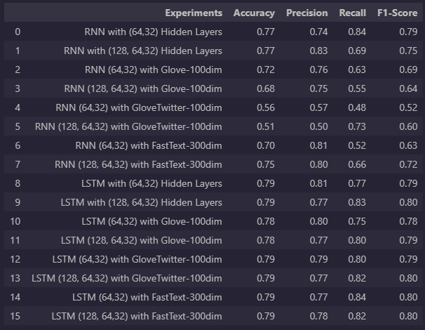

# Sentiment Analysis Project

This project involves working with the Sentiment140 dataset from Kaggle to perform various text classification tasks. The primary objective is to train and evaluate different models for sentiment analysis on the dataset.

## Table of Contents

- [Introduction](#introduction)
- [Tasks](#tasks)
- [Dataset](#dataset)
- [Preprocessing](#preprocessing)
- [Model Training](#model-training)
- [Evaluation](#evaluation)
- [Conclusion](#conclusion)

## Introduction

This project aims to analyze sentiments in text data using machine learning models. The Sentiment140 dataset contains labeled Twitter data with sentiments categorized as negative, neutral, or positive. The project involves preprocessing the data, training various models, and evaluating their performance.

## Tasks

The main tasks performed in this project include:

1. Loading and understanding the Sentiment140 dataset.
2. Cleaning the text data by removing stop words and punctuation.
3. Splitting the dataset into training and testing sets.
4. Training models using Recurrent Neural Networks (RNNs) and Long Short-Term Memory (LSTM) networks with different configurations.
5. Using different word embeddings, including self-trained and pre-trained (GloVe, GloVe-twitter, FastText).
6. Creating a table to report accuracy, precision, recall, and F1 scores for each experiment.

## Dataset

The Sentiment140 dataset contains tweets with sentiment labels: 0 (negative), 1 (neutral), and 4 (positive). The dataset is available at [https://www.kaggle.com/datasets/kazanova/sentiment140](https://www.kaggle.com/datasets/kazanova/sentiment140).

## Preprocessing

The text data is preprocessed by removing stop words and punctuation. This helps in reducing noise and improving the quality of input data for the models.

## Model Training

Various models are trained for sentiment analysis:

1. RNN with an embedding layer and two hidden layers (64, 32).
2. RNN with an additional layer of 128 before the first hidden layer.
3. Using pre-trained GloVe word embeddings (100-dim).
4. Using pre-trained GloVe-twitter word embeddings.
5. Using pre-trained FastText word embeddings.
6. Replacing RNN with LSTM in all the above configurations.

## Evaluation

For each of the 16 experiments, the trained models are evaluated on the test dataset. The evaluation metrics include accuracy, precision, recall, and F1 score. The results are reported below in a tabular format.

## Conclusion

This project demonstrates the process of sentiment analysis on the Sentiment140 dataset using various machine learning models and word embeddings. By comparing the performance metrics of different experiments, we aim to identify the best-performing model for sentiment classification.

## How to Use

To replicate and understand the work, follow these steps:

1. Download the Sentiment140 dataset from the provided Kaggle link.
2. Preprocess the data by removing stop words and punctuation.
3. Split the dataset into training and testing sets with a 30-70 ratio.
4. Train the specified models with different configurations as described.
5. Evaluate each model on the test dataset and record the performance metrics.
6. Analyze the results and identify the best-performing model.
7. Modify and customize the code as needed for your own projects.

Remember to ensure that you comprehend each aspect of the code and can explain the rationale behind each decision made in the project.

For any questions or clarifications, feel free to reach out via GitHub issues or email.

_Note: This project is based on a hypothetical assignment and serves as an example readme file._
